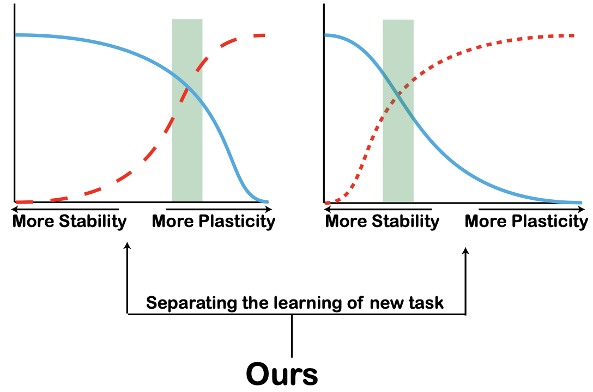

# Loss Decoupling for Task-Agnostic Continual Learning
Code For NeurIPS'2023 paper "[Loss Decoupling for Task-Agnostic Continual Learning]"

## Introduction

<div align="justify">
Continual learning requires the model to learn multiple tasks in a sequential order. To perform continual learning, the model must possess the abilities to maintain performance on old tasks (stability) and adapt itself to learn new tasks (plasticity). Task-agnostic problem in continual learning is a challenging problem, in which task identities are not available in the inference stage and hence the model must learn to distinguish all the classes in all the tasks. In task-agnostic problem, the model needs to learn two new objectives for learning a new task, including distinguishing new classes from old classes and distinguishing between different new classes. For task-agnostic problem, replay-based methods are commonly used. These methods update the model with both saved old samples and new samples for continual learning. Most existing replay-based methods mix the two objectives in task-agnostic problem together, inhibiting the models from achieving a good trade-off between stability and plasticity. In this paper, we propose a simple yet effective method, called loss decoupling (LODE), for task-agnostic continual learning. LODE separates the two objectives for the new task by decoupling the loss of the new task. As a result, LODE can assign different weights for different objectives, which provides a way to obtain a better trade-off between stability and plasticity than those methods with coupled loss. Experiments show that LODE can outperform existing state-of-the-art replay-based methods on multiple continual learning datasets.
</div>

<center>

</center>

## Requisite

This code is implemented in PyTorch, and we have tested the code under the following environment settings:

- python = 3.8
- torch = 1.13.1
- torchvision = 0.14.1

## run for experiments

```
bash Script/derpp.sh
bash Script/esmer.sh
```


We would like to thank the authors of the following repositories (from which we borrowed code). </br>
* https://github.com/aimagelab/mammoth
